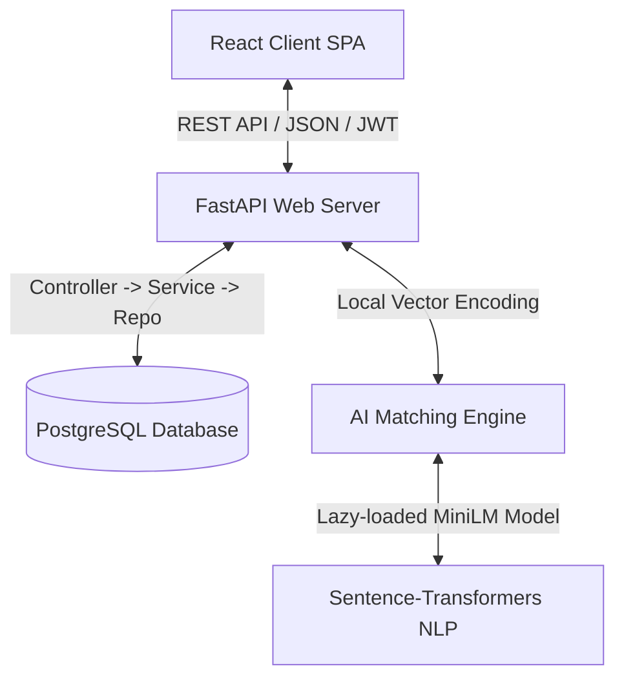
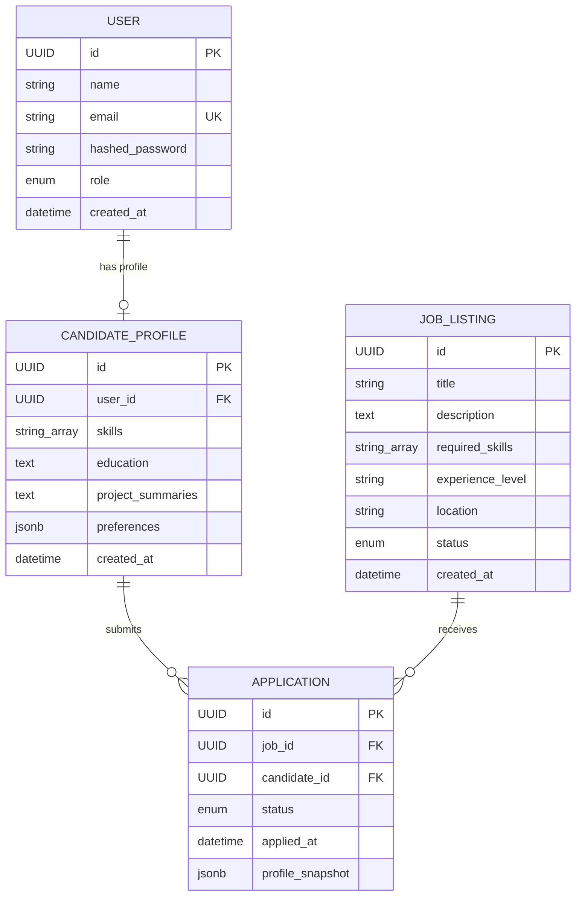

# Product Requirement Document (PRD): JOBBoard Project
## AI-Powered Job Board & Candidate Matching Platform

### Document Metadata
| Metadata Field | Value |
|---|---|
| **Document Version** | 1.0.0 |
| **Status** | Approved |
| **Author** | Antigravity AI (Lead Architect & Senior Engineer) |
| **Target Audience** | Engineering Team, Product Managers, Recruiters, and Stakeholders |
| **Date** | June 24, 2026 |

---

## 1. Executive Summary
The JOBBoard Project is an automated talent acquisition platform and job board that bridges the gap between candidates and open roles using advanced semantic search and AI matching algorithms. In traditional platforms, keyword-based search fails to capture the context and transferability of skills. The JOBBoard Project addresses this by using natural language embeddings to match candidate profiles to job descriptions, calculating a similarity score, and providing plain-text explanations to recruitment administrators to support hiring decisions.

---

## 2. Problem Statement & Target Audience
### 2.1 The Problem
- **Recruiters** spend hours filtering resumes with rigid keyword queries that miss highly qualified candidates who use alternative terminology (e.g., "FastAPI specialist" vs. "Python backend engineer").
- **Candidates** struggle to find roles that align semantically with their project history and tech stacks, leading to irrelevant applications.
- **System administrators** lack structured analytical dashboards showing the skills breakdown of incoming applicant pipelines, making workforce planning difficult.

### 2.2 Target Audience & Roles
1. **Recruiter / Admin**: Responsible for posting jobs, managing listings, tracking pipelines, viewing applicants, and assessing AI-generated candidate compatibility.
2. **Candidate**: Responsible for creating profiles, updating skills, detailing projects, and applying to open positions.

---

## 3. Product Vision & Goals
- **Objective Matching**: Rank candidates based on semantic skills alignment and project summaries, reducing manual vetting time by 70%.
- **Local & Cost-Effective Inference**: Use local sentence-transformer models instead of expensive external LLM API calls, ensuring high privacy and low operational costs.
- **Context Preservation**: Save immutable snapshots of candidate profiles at the time of application to maintain a clear audit trail.
- **Rich Aesthetics**: A cohesive dark-themed glassmorphism interface featuring interactive widgets, analytics, and responsive controls.

---

## 4. Key Functional Requirements

### 4.1 Authentication & Authorization
- **Multi-Role Support**: Distinguish between `admin` (recruiter) and `candidate` users.
- **Session Security**: JWT-based access tokens with local storage and request interception headers.
- **Admin Login Page**: A premium, secure login gateway with error notifications.

### 4.2 Job Management (Admin Console)
- **CRUD Operations**: Admins can create and edit job postings.
- **Toggle Listing Status**: Admins can open/close jobs dynamically using a toggle switch. Closed jobs stop accepting applications.
- **Listings View**: Categorize listings with active application counts.
- **Active Job Filtering**: Candidates/guests only see active (`open`) jobs, whereas admins see all records.
- DB Model Reference: [job.models.py](file:///c:/Drive/JobPortel/JobPortal.server/src/models/job.models.py)

### 4.3 Candidate Profile Management
- **Structured Fields**: Candidates manage a profile containing a unique user relationship, skills array, education summary, project summaries, and preferences JSON.
- **Profile Snapshotting**: When a candidate applies, the platform takes a static snapshot of their profile, saving it in the application record to protect historical data against future profile modifications.
- DB Model Reference: [candidate.models.py](file:///c:/Drive/JobPortel/JobPortal.server/src/models/candidate.models.py)

### 4.4 Job Application Pipeline
- **Apply Workflow**: Validates job status (must be `open`), checks if the candidate exists, and prevents duplicate applications.
- **Status Updates**: Admins can transition applications through a pipeline: `applied` ➔ `shortlisted` ➔ `rejected`.
- DB Model Reference: [application.models.py](file:///c:/Drive/JobPortel/JobPortal.server/src/models/application.models.py)

### 4.5 AI-Powered Semantic Candidate Matching
- **Semantic Vector Embeddings**: Embed candidate profiles and job details into high-dimensional vectors via a local [SentenceTransformer](file:///c:/Drive/JobPortel/JobPortal.server/src/ai/embeddings.py) (`all-MiniLM-L6-v2`).
- **Matching Engine**: Coordinates matching scores using the following logic:
  - **Cosine Similarity (70%)**: Compares candidate profile string (skills, projects, education, user query context) with the job listing metadata (title, description, required skills, experience level).
  - **Direct Skill Overlap (30%)**: Calculates intersection ratios of candidate skills against job required skills.
  - **Keyword Fallback**: If the local AI embedding model fails or is uninstalled, matches default to a combination of skill overlap ratios and Jaccard similarity.
- **AI Match Explanation**: Dynamically translates scores and overlaps into a readable 1-2 sentence breakdown (e.g., *"Matches candidate's expertise in Python, FastAPI with 85% query-to-job relevance. Some skill gaps remain in Docker."*).
- Code References:
  - Embedding Generator: [embeddings.py](file:///c:/Drive/JobPortel/JobPortal.server/src/ai/embeddings.py)
  - Matching Logic: [matcher.py](file:///c:/Drive/JobPortel/JobPortal.server/src/ai/matcher.py)
  - Explanation Generator: [explainer.py](file:///c:/Drive/JobPortel/JobPortal.server/src/ai/explainer.py)

### 4.6 Analytics & Pipeline Visualization
- **Dashboard Metrics**: Active counts of Total Applicants, Shortlisted Candidates, and Active Pipelines.
- **Skill Distribution Visualizer**: Extracts and aggregates skill occurrences across all candidates applying to a selected job, displaying them as a gradient progress chart (percentage distribution).
- UI Reference: [AdminDashboard.jsx](file:///c:/Drive/JobPortel/JobPortal.client/src/pages/AdminDashboard.jsx)

---

## 5. Non-Functional Requirements

### 5.1 Performance & Latency
- **Embedding Cache**: Lazy-load the SentenceTransformer model on the first request and cache the model instance to keep backend start-ups fast.
- **Search Latency**: Cosine similarity calculations must complete in less than 50ms for up to 1,000 open job listings.

### 5.2 Security
- **Hashed Credentials**: Passwords must be hashed using `bcrypt` in the security layer before writing to PostgreSQL.
- **Data Encapsulation**: SQL parameters must be bound via SQLAlchemy ORM queries to prevent SQL injections.
- **Route Authorization**: Restrict access to admin dashboards, analytics, and job creation endpoints using OAuth2 token authentication scopes.

### 5.3 UX/UI & Aesthetics
- **Theme**: Premium futuristic dark mode.
- **Visual Styles**: Translucent glassmorphism panels (`backdrop-filter: blur`), linear gradients, interactive badges, transitions on buttons/switches, and clean tabular data layouts.

---

## 6. Architecture & Data Flow

### 6.1 Component Architecture

### 6.2 Data Model Relationships

---

## 7. Implementation & Verification Plan

### 7.1 Automated Testing
- Execute local database migrations using Alembic.
- Run FastAPI app tests verifying auth tokens, job listings filters, application status changes, and semantic match endpoint structures.

### 7.2 Manual Verification
1. Launch postgres database and run `python seed.py` to seed mock admin and candidate records.
2. Spin up client development server on `http://localhost:5173`.
3. Log in with admin credentials (`admin@test.com` / `admin123`).
4. Select a seeded job (e.g. *Backend Software Engineer*) and inspect:
   - Applicant list.
   - Applications statistics (Total, Shortlisted, Active).
   - Candidate Skills Distribution progress bars.
   - Job Status toggles (open/closed behavior).
